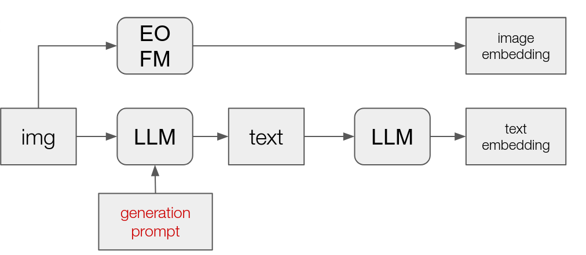

# Generative AI in Earth Observation

Generating and evaluating LLM generated text descriptions of satellite imagery

## Generation

 

## Evaluation

sampling pairs of images

 

## Challenges

- text generation is done with RGB only
- text generation is expensive
- could do prompt optimization for generating text description of imagery (see examples at [google vertex ai](https://cloud.google.com/vertex-ai/generative-ai/docs/learn/prompts/prompt-optimizer) or [anthropic](https://docs.anthropic.com/en/docs/build-with-claude/prompt-engineering/prompt-improver))