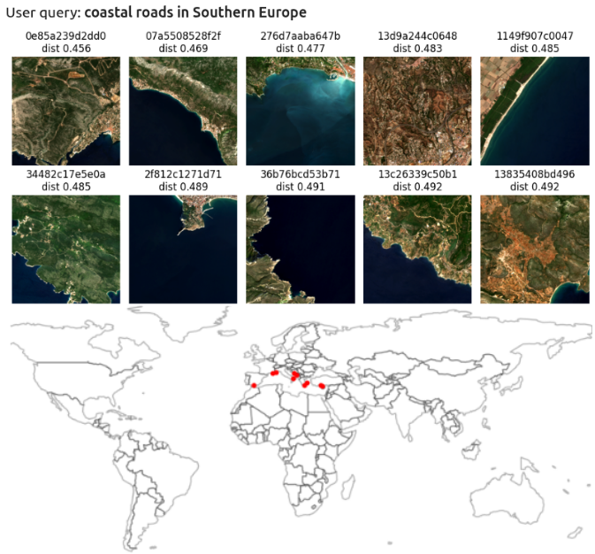

# GeoQuery Proof of Concept

We use an **LLM to generate text descriptions of satellite imagery**, and then do **semantic search** just by using text embeddings. We also use image embeddings to validate how image descriptions can mimic them.

This is an example. Observe we only use a **semantic search** through embeddings and yet they are sensible to geographic location.

 


## Worflow

We use the following proces to generate image and text embeddings for each satellite image. We use 

- [Gemini 2.5](https://ai.google.dev/gemini-api/docs/models) to generate descriptions of satellite images.
- [Gemini 2.5 embeddings](https://ai.google.dev/gemini-api/docs/embeddings) to generate text embeddings from the text description of satellite images.
- [Clay Earth Observation Foundation Model](https://github.com/Clay-foundation/model) to generate the image embeddings.

 

## Instalation

You must have a Google API key for `Generative AI API` and `Geocoding API`. Then do

```
pip install -r requirements.txt
```

## Data

We provide precomputed image and text embeddings for 48k locations around the world, together with their Sentinel2 RGB imagery in chips sized 512x512 pixels at 10m/pixel.

Download and unzip the data for the notebooks in this repo

```
wget https://storage.googleapis.com/disasterbrain-public/hackaton-48k-consolidated.tar.gz
```

and adjust the paths in the notebooks accordingly.

The tar file includes one `pkl` file for each image chip with a dictionary containing the image pixels and the text and image embeddings, together with metadata (location, geometry, etc.). The tar file also includes the [Clay model](https://github.com/Clay-foundation/model) weights used to generate the image embeddings.

## Forthcoming work

Include GeoQuery within an agentic system to discern user intention and integrate semantic search into a conversational workflow with world wide satellite imagery.